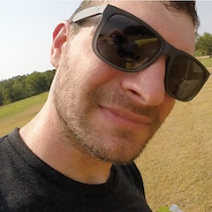

## About Me

I work with infrastructure hosting services and open source tooling to help business manage their application lifecycles in the cloud. I love building continuous integration and testing plans, deployment pipelines, monitoring and alerting scenarios, physical to cloud migration strategies, and everything containers.

## Contact

Feel free to contact me at [andys@andyshinn.as](mailto:andys@andyshinn.as). Check me out on [LinkedIn](https://www.linkedin.com/in/andyshinn/) and [GitHub](https://github.com/andyshinn).
